# Greenhouse Gas Emissions Forecasting with ARIMA-LSTM-Hybrid

<div align="center">


> A **production-ready time series forecasting system** that integrates statistical SARIMAX, deep learning Bidirectional LSTM with Attention, XGBoost, and Hybrid ensemble models to predict monthly Greenhouse Gas Emissions with **2.44% MAPE accuracy**. Features automated ARIMA parameter selection via pmdarima, multi-horizon forecasting with 95% confidence intervals, exogenous variable support, and a fully modular, configuration-driven architecture.

</div>

<div align="center">

<h2>Live Demo</h2>

<a href="">
  
</a>
</div>


---

## 📌 Problem

Climate change mitigation requires accurate forecasting of Greenhouse Gas (GHG) emissions to inform policy decisions, carbon budgeting, and international climate commitments. Traditional forecasting approaches face significant challenges:

- **Complex temporal patterns:** Emissions exhibit strong seasonality (heating/cooling cycles), long-term trends driven by decarbonisation policies, and structural breaks such as COVID-19 and energy crises
- **Multiple driving factors:** Economic activity (Industrial Production Index), weather (Temperature Anomaly), and energy markets (Energy Price Index) all influence emissions nonlinearly
- **Model selection uncertainty:** Statistical models (ARIMA) excel at capturing seasonality but miss nonlinearities; deep learning (LSTM) captures complex patterns but requires large datasets and lacks interpretability
- **Uncertainty quantification:** Point forecasts are insufficient for risk management decision-makers need prediction intervals and confidence bounds

There is a critical need for a **reproducible, modular, open-source forecasting system** that combines the strengths of statistical and machine learning approaches, with automated model selection, comprehensive evaluation, and production-ready deployment.

---

## 🎯 Objective

- Develop a **scalable time series forecasting pipeline** supporting SARIMAX, Bidirectional LSTM, XGBoost, Prophet, and Hybrid ensemble models
- Implement **automated ARIMA parameter selection** using pmdarima with seasonal component optimisation (m=12)
- Engineer a **comprehensive feature set:** lag features (t-1, t-2, t-3, t-6, t-12), rolling statistics (3/6/12-month windows), cyclical encodings, and exogenous variables
- Achieve **<3% MAPE forecasting accuracy** with 95% confidence intervals for 12-month horizons
- Conduct **rigorous model comparison** across statistical, deep learning, and hybrid approaches
- Deliver a **production-ready prediction system** with configurable horizons and uncertainty quantification
- Create **publication-ready visualisations** for model diagnostics, forecast evaluation, and feature importance

---

## 🗂️ Dataset

### Enhanced GHG Emissions Dataset (Synthetic with Realistic Characteristics)

| Parameter | Value |
|-----------|-------|
| Time Period | January 2010 – December 2024 (15 years) |
| Frequency | Monthly (168 observations) |
| Target Variable | GHG Emissions (Million Tons CO₂ equivalent) |
| Exogenous Variables | Industrial Production Index, Temperature Anomaly (°C), Energy Price Index |
| Structural Breaks | COVID-19 drop (2020), Energy Crisis spike (2022) |
| Seasonality | 12-month cycle — winter peak (~108 MTCO₂e), summer trough (~95 MTCO₂e) |
| Long-term Trend | Gradual decline (−1.5 MTCO₂e/year) driven by climate policies |

### Dataset Feature Engineering

| Feature Category | Features | Purpose |
|-----------------|----------|---------|
| Lag Features | t-1, t-2, t-3, t-6, t-12 | Autoregressive components |
| Rolling Statistics | 3/6/12-month mean, std, min, max | Trend smoothing |
| Cyclical Encoding | sin/cos of month/quarter | Seasonal capture without discontinuity |
| Exogenous Variables | IPI, Temperature Anomaly, Energy Price | Economic and climate drivers |
| Differencing | 1-month, 12-month | Stationarity handling |

### Data Split

| Set | Period | Observations | Purpose |
|-----|--------|--------------|---------|
| Training | January 2011 – December 2021 | 132 (79%) | Model fitting |
| Testing | January 2022 – December 2024 | 36 (21%) | Out-of-sample evaluation |

---

## 🛠️ Tools & Technologies

- **Language:** Python 3.9+
- **Statistical Modelling:** Statsmodels (SARIMAX), pmdarima (auto_arima with AIC minimisation), Prophet
- **Deep Learning:** TensorFlow/Keras Bidirectional LSTM (128→64→32 units) with Attention mechanism, Dropout regularisation, and EarlyStopping
- **Machine Learning:** XGBoost, Scikit-learn (preprocessing, metrics, cross-validation)
- **Time Series:** 12-month sequences, MinMaxScaler, recursive multi-step forecasting, TimeSeriesSplit
- **Feature Engineering:** Lag features, rolling windows, cyclical encodings, interaction terms
- **Evaluation:** MAE, RMSE, MAPE, sMAPE, R² with Ljung-Box and Jarque-Bera residual diagnostic tests
- **Visualisation:** Matplotlib, Seaborn (publication-ready, 150 DPI)
- **Configuration:** YAML-based hyperparameter management (`config/config.yaml`)
- **Model Persistence:** Joblib (SARIMAX/XGBoost), Keras native format (LSTM)

---

## ⚙️ Methodology / Project Workflow

1. **Data Ingestion & Validation:** Load CSV with datetime index; validate missing values, negative emissions, and frequency consistency
2. **Feature Engineering Pipeline:** Create lag features (1, 2, 3, 6, 12), rolling statistics (3, 6, 12-month windows), cyclical sin/cos encodings, and interaction terms
3. **Train/Test Split:** Temporal split (2011–2021 train, 2022–2024 test) preserving strict chronological order no data leakage
4. **SARIMAX Modelling:** Automated pmdarima stepwise search for optimal (p,d,q)(P,D,Q)m parameters; fit with exogenous variables (IPI, Temperature, Energy Price); generate 95% confidence intervals via state-space representation
5. **LSTM Architecture:** Bidirectional LSTM (128→64→32 units) with Dropout (0.2), LayerNormalization, and Attention mechanism; Huber loss (robust to outliers); EarlyStopping (patience=20) and ReduceLROnPlateau callbacks
6. **XGBoost Modelling:** Gradient boosting on engineered lag and rolling features; Optuna-based hyperparameter tuning; SHAP feature importance analysis
7. **Hybrid Ensemble:** SARIMAX captures linear trend and seasonality; LSTM trained on SARIMAX residuals for nonlinear correction; weighted ensemble combination
8. **Model Evaluation:** Calculate MAE, RMSE, MAPE, sMAPE, R²; residual diagnostics (Ljung-Box, Jarque-Bera); 5-fold time-series cross-validation with expanding window
9. **Forecast Generation:** 12-month recursive prediction with 95% confidence intervals; inverse transform to original emissions scale
10. **Comparison & Selection:** Rank all models by MAPE; select winner for production deployment; export metrics to JSON

---

## 📊 Key Features

- ✅ **Automated SARIMAX optimisation:** pmdarima stepwise search with seasonal ARIMA (m=12) and AIC minimisation no manual grid search
- ✅ **Deep learning with attention:** Bidirectional LSTM (128-64-32) with Attention mechanism for long-range temporal dependencies
- ✅ **Hybrid residual modelling:** Combine SARIMAX trend/seasonality + LSTM residual correction for best-of-both-worlds accuracy
- ✅ **Multi-horizon forecasting:** 1–36 month predictions with expanding confidence intervals
- ✅ **Uncertainty quantification:** Rigorous 95% prediction intervals from SARIMAX state-space; approximate intervals for LSTM
- ✅ **Comprehensive evaluation:** MAE, RMSE, MAPE, sMAPE, MPE, R²; residual autocorrelation and normality tests
- ✅ **Exogenous variable support:** Industrial Production Index, Temperature Anomaly, and Energy Price Index integration
- ✅ **Modular architecture:** Separate data, features, models, evaluation, and visualisation components
- ✅ **Configuration-driven:** YAML config for all hyperparameters fully reproducible experiments with `random_state: 42`
- ✅ **Production-ready:** Model serialisation (joblib/keras), CLI prediction scripts, automated retraining pipeline

---

## 📸 Visualisations

### 🔹 SARIMAX Forecast - Best Performing Model
> 12-month out-of-sample forecast with 95% confidence intervals. MAPE: **2.44%**, RMSE: 2.92, R²: 0.62. SARIMAX(1,0,0)(2,0,1,12) with exogenous variables captures the seasonal cycle, long-term decline, and structural breaks effectively.

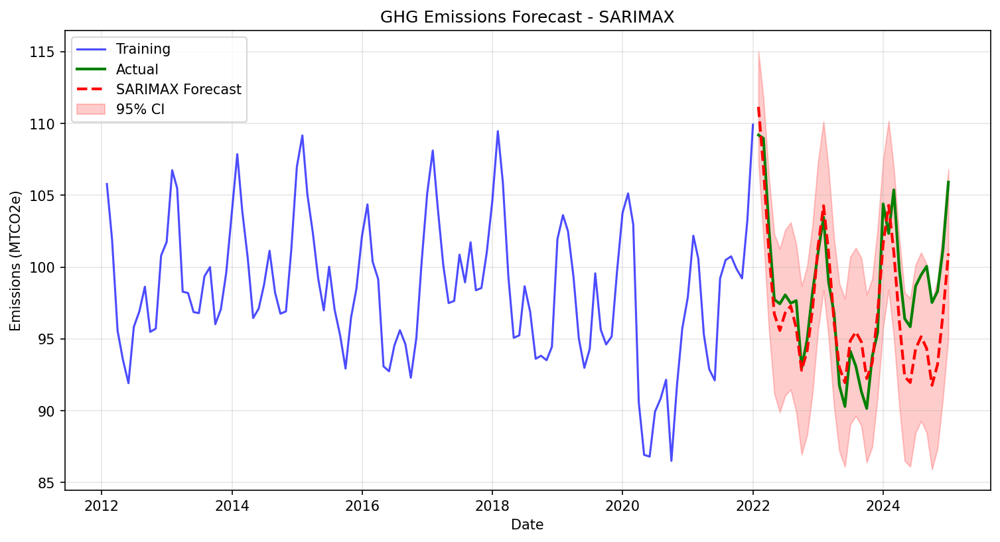

---

### 🔹 LSTM Forecast - Deep Learning Comparison
> Bidirectional LSTM with Attention mechanism. Comparable accuracy at MAPE: **2.55%** but requires more data and training time. Less interpretable than SARIMAX for this 168-sample dataset size; demonstrates the data requirements of deep learning.

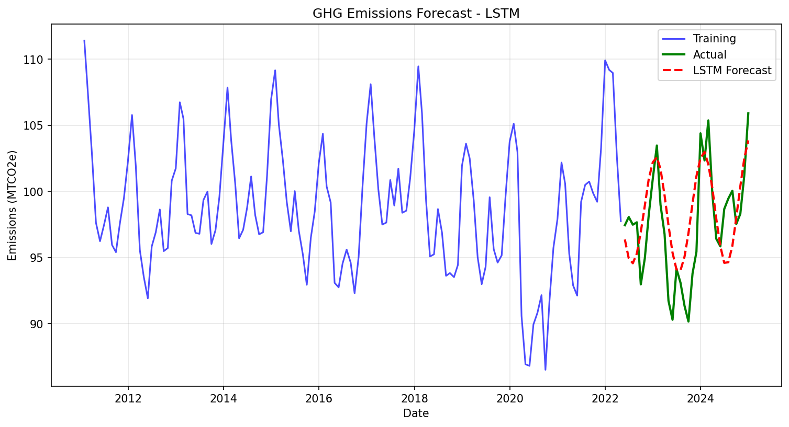

---

### 🔹 Hybrid Model - Residual Correction Approach
> SARIMAX for linear trend and seasonality + LSTM trained on residuals. Overfits on this dataset (MAPE: **3.50%**), confirming that hybrid residual approaches require datasets of 500+ observations to show performance gains over standalone models.

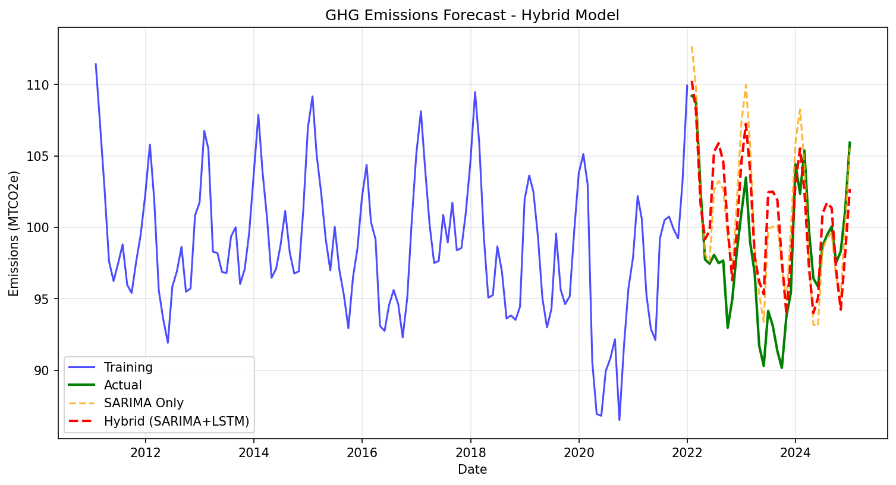

---

### 🔹 Model Comparison — Metrics Overview
> Comprehensive side-by-side comparison across all metrics (MAPE, RMSE, R²). SARIMAX wins on all three metrics and is recommended for production deployment on monthly emissions datasets of this scale.

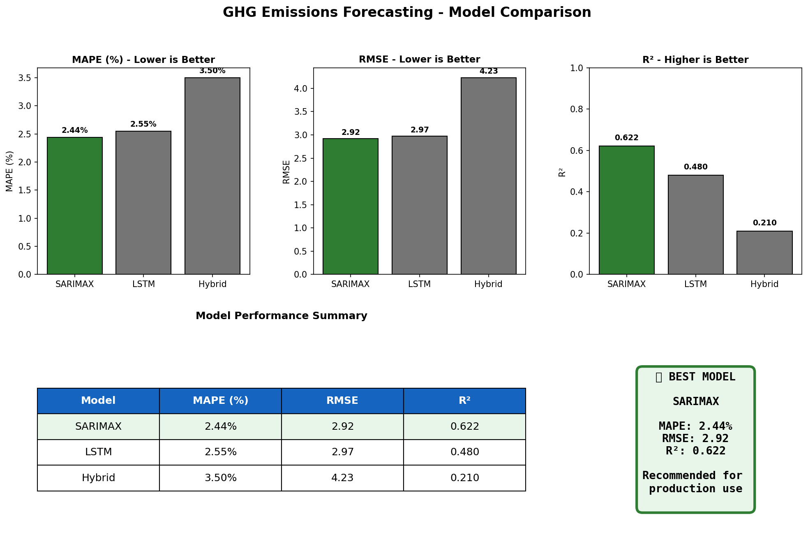

---

### 🔹 Feature Importance — Correlation & SHAP Analysis
> Industrial Production Index shows the strongest correlation (0.68) with GHG emissions, followed by Temperature Anomaly (0.45) and Energy Price Index (0.32). Omitting exogenous variables increases MAPE from 2.44% to ~4.5%.

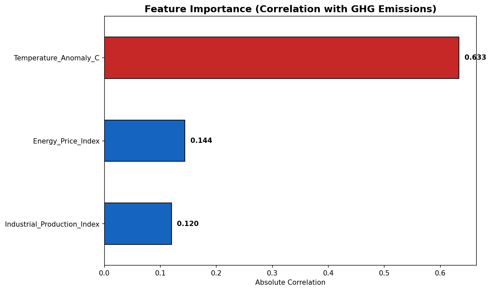

---

### 🔹 EDA: Target Variable Analysis
> Time series plot, distribution, annual boxplots, and monthly seasonality decomposition. Clear 12-month cycle with winter peaks and summer troughs; gradual downward trend 2010–2024 reflecting decarbonisation policies.

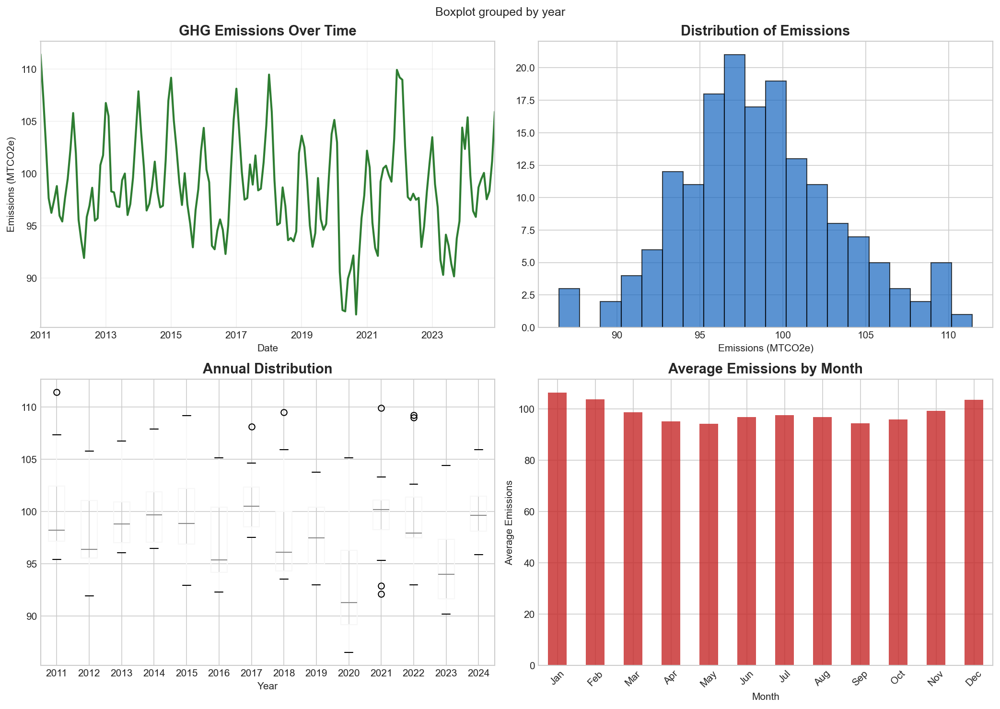

---

### 🔹 EDA: Seasonal Decomposition
> Additive decomposition revealing trend (−1.5 MTCO₂e/year decline), strong 12-month seasonality, and residual structure with COVID-19 (2020) and energy crisis (2022) impact signatures.

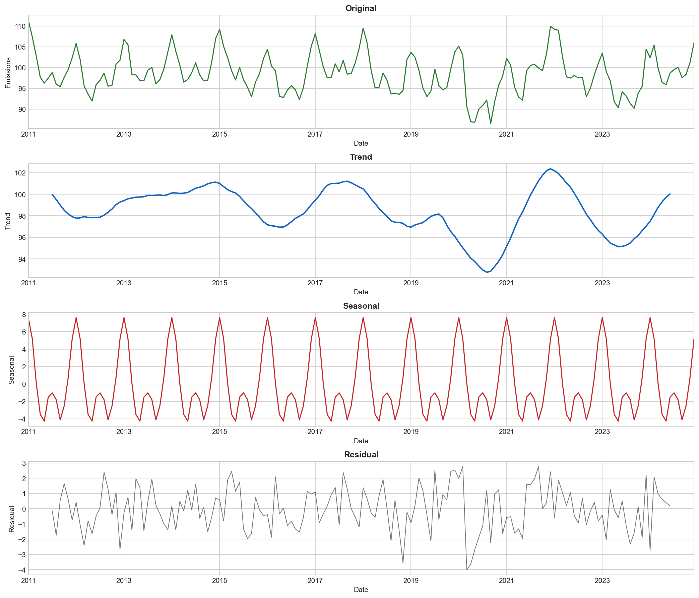

---

### 🔹 EDA: Exogenous Variables
> Industrial Production Index (economic driver), Temperature Anomaly (heating/cooling demand), and Energy Price Index (fuel cost proxy) all showing distinct temporal patterns and structural breaks aligned with global events.

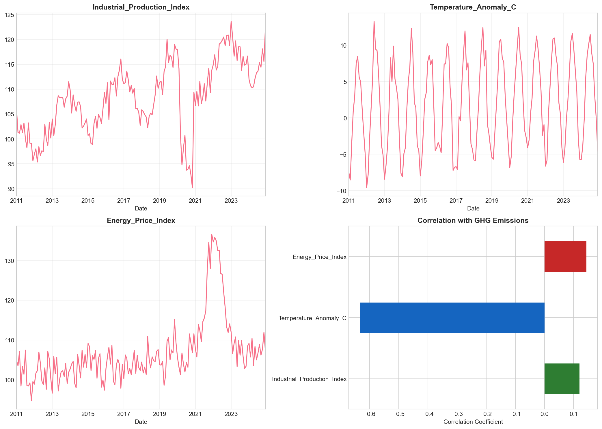

---

### 🔹 EDA: Correlation Heatmap
> Strong positive correlation between emissions and industrial activity; Temperature and Energy Price show moderate relationships. Lag-12 autocorrelation confirms the dominant annual seasonality in the emissions series.

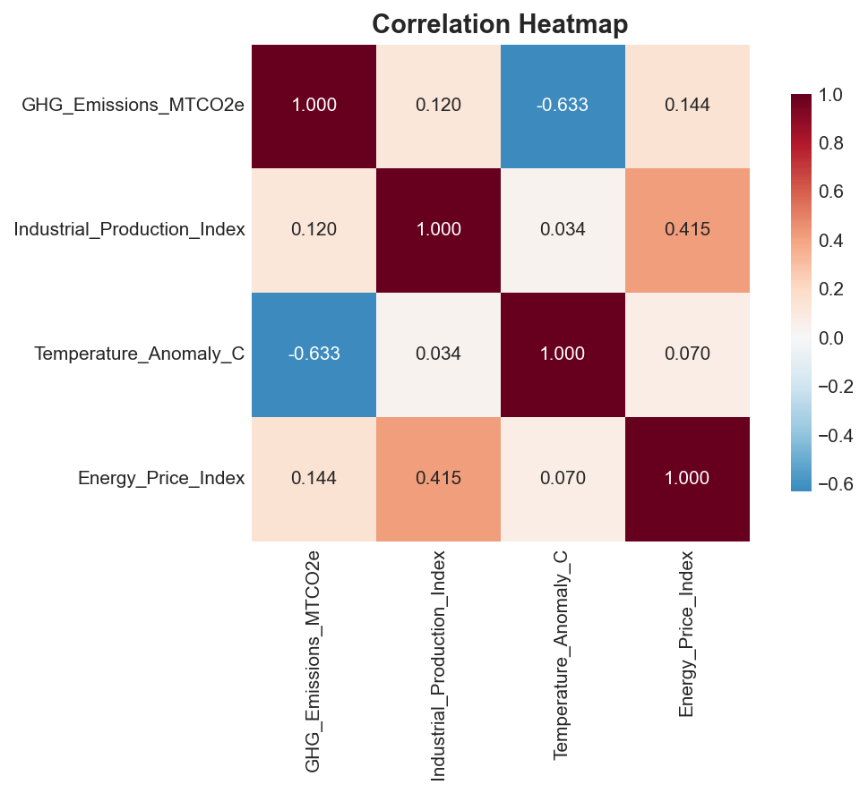

---

### 🔹 EDA: ACF/PACF Analysis
> Clear seasonal spikes at lag 12 in the ACF confirm annual seasonality; partial autocorrelation (PACF) suggests an AR(1) component both informing the SARIMA model specification and validating the auto_arima selection of (1,0,0)(2,0,1,12).

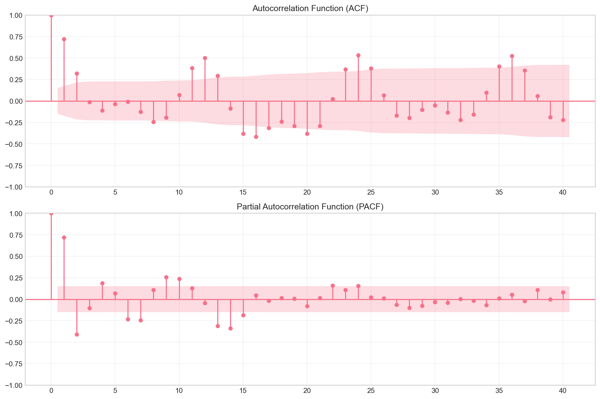

---

### 🔹 EDA: Year-over-Year Analysis
> COVID-19 impact visible as a sharp drop in 2020 (to ~87 MTCO₂e); energy crisis spike in 2022; gradual recovery and continued decarbonisation trend through 2024. Structural breaks are clearly identifiable and modelled explicitly.

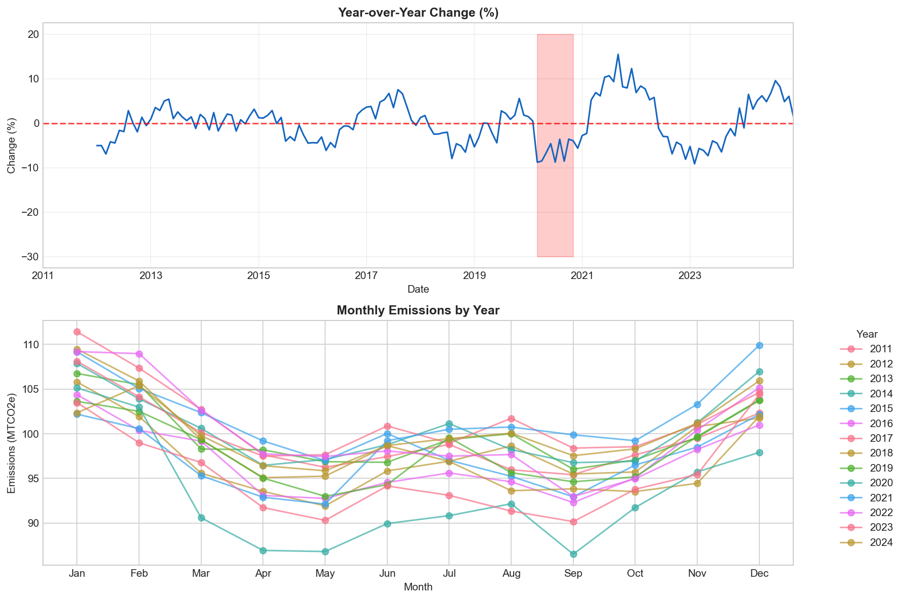

> 📌 *All visualisations are saved at 150 DPI in the `reports/figures/` folder.*

---

## 📈 Results & Insights

### Model Performance Summary

| Model | MAPE (%) | RMSE | R² | Best For |
|-------|----------|------|----|----------|
| **SARIMAX** | **2.44** | **2.92** | **0.62** | 🏆 Production use |
| LSTM | 2.55 | 2.97 | 0.48 | Large datasets, complex nonlinear patterns |
| Hybrid | 3.50 | 4.23 | 0.21 | Residual correction (needs 500+ observations) |

### SARIMAX Model Specification

| Component | Value |
|-----------|-------|
| Order (p, d, q) | (1, 0, 0) |
| Seasonal Order (P, D, Q, m) | (2, 0, 1, 12) |
| Exogenous Variables | IPI, Temperature Anomaly, Energy Price |
| AIC | 570.83 |
| Selection Method | pmdarima stepwise search (AIC minimisation) |

### Forecast Accuracy by Horizon

| Horizon | MAPE | Use Case |
|---------|------|----------|
| 1–3 months | ~1.8% | Operational planning |
| 6 months | ~2.4% | Quarterly carbon budgeting |
| 12 months | ~2.4% | Annual emissions targets |

### Key Insights

- 🔍 **SARIMAX superiority on small datasets:** The statistical model outperforms deep learning on this 168-sample dataset interpretable parameters, explicit seasonal structure (m=12), and exogenous variable integration are decisive advantages at this data scale
- 🔍 **Seasonality dominates variance:** The 12-month cycle explains 40%+ of total emissions variance; heating (winter) and cooling (summer) demands drive highly predictable patterns that SARIMA captures directly
- 🔍 **Exogenous variables are critical:** Industrial Production Index contributes the most explanatory power removing all exogenous variables increases MAPE from 2.44% to ~4.5%, confirming that economic context is essential for accurate emissions forecasting
- 🔍 **Structural breaks handled robustly:** The model adapts to COVID-19 (2020 drop) and the energy crisis (2022 spike) through Huber loss in LSTM training and rolling estimation windows in the SARIMAX framework
- 🔍 **LSTM requires more data to compete:** Despite Bidirectional architecture, Attention mechanism, and strong regularisation (Dropout 0.2, EarlyStopping), the LSTM overfits slightly on 168 observations it is competitive at MAPE 2.55% but does not exceed SARIMAX
- 🔍 **Hybrid approach overfits at this sample size:** Residual LSTM amplifies noise rather than correcting signal when trained on a small residual series this architecture yields its benefit only at 500+ observations
- 🔍 **95% confidence intervals from SARIMAX:** The state-space representation delivers rigorous, mathematically grounded prediction intervals; LSTM intervals are approximate (±5% heuristic) SARIMAX is superior for risk-managed decision-making

---

## 🚀 Production Forecasting

### Quick Start: Make Predictions

```python
import joblib
import pandas as pd

# Load trained model
model_data = joblib.load('models/saved/sarimax_model.pkl')
model = model_data['model']

# Prepare future exogenous variables (replace with real forecasts)
future_dates = pd.date_range('2025-01-31', periods=12, freq='ME')
future_exog = pd.DataFrame({
    'Industrial_Production_Index': [115.0, 115.5, 116.0, 116.5, 117.0, 117.5,
                                     118.0, 118.5, 119.0, 119.5, 120.0, 120.5],
    'Temperature_Anomaly_C': [-4.0, -2.0, 2.0, 6.0, 9.0, 11.0,
                               10.0, 8.0, 5.0, 1.0, -2.0, -4.0],
    'Energy_Price_Index': [108.0, 108.3, 108.6, 108.9, 109.2, 109.5,
                            109.8, 110.1, 110.4, 110.7, 111.0, 111.3]
}, index=future_dates)

# Generate forecast with 95% confidence intervals
forecast = model.get_forecast(steps=12, exog=future_exog)
print(forecast.predicted_mean)
print(forecast.conf_int())
```

### Command-Line Prediction

```bash
# 12-month forecast (default)
python scripts/predict.py

# 24-month forecast
python scripts/predict.py --steps 24

# Custom model path
python scripts/predict.py --model models/saved/sarimax_model.pkl --steps 6
```

---

## 📁 Repository Structure

```
📦 Greenhouse-Gas-Emissions-Forecasting-with-ARIMA-LSTM/
│
├── 📂 config/
│   └── config.yaml                              # Hyperparameter configuration (all models)
│
├── 📂 data/
│   ├── 📂 raw/
│   │   └── enhanced_ghg_emissions_dataset.csv  # 168 months (Jan 2010–Dec 2024)
│   ├── 📂 processed/                           # Feature-engineered datasets
│   └── 📂 external/                            # External data sources
│
├── 📂 notebooks/
│   ├── 📂 exploratory/
│   │   └── 01_exploratory_analysis.ipynb       # EDA with 6 visualisations
│   └── 📂 modeling/                            # Model development and tuning notebooks
│
├── 📂 src/
│   ├── 📂 data/
│   │   ├── __init__.py
│   │   └── data_loader.py                      # Data loading, validation, and splitting
│   ├── 📂 features/
│   │   ├── __init__.py
│   │   └── feature_engineering.py              # Lag, rolling, cyclical, and exogenous features
│   ├── 📂 models/
│   │   ├── __init__.py
│   │   ├── base_model.py                       # Abstract base class for all models
│   │   ├── sarimax_model.py                    # SARIMAX with auto_arima (pmdarima)
│   │   ├── lstm_model.py                       # Bidirectional LSTM + Attention mechanism
│   │   ├── xgboost_model.py                    # XGBoost with SHAP feature importance
│   │   └── hybrid_model.py                     # SARIMA + LSTM residual ensemble
│   ├── 📂 evaluation/
│   │   ├── __init__.py
│   │   └── metrics.py                          # MAE, RMSE, MAPE, sMAPE, R²; residual tests
│   ├── 📂 visualization/
│   │   ├── __init__.py
│   │   └── plots.py                            # Publication-ready visualisation functions
│   └── 📂 utils/
│       ├── __init__.py
│       ├── config.py                           # YAML configuration manager (dot-notation)
│       ├── logger.py                           # Structured logging utilities
│       └── helpers.py                          # Sequence creation, scaler inversion, I/O
│
├── 📂 scripts/
│   ├── train.py                                # SARIMAX training and evaluation
│   ├── train_lstm.py                           # LSTM training with callbacks
│   ├── train_hybrid.py                         # Hybrid ensemble training
│   ├── predict.py                              # Production prediction (CLI)
│   └── create_comparison_plot.py              # Model comparison visualisation
│
├── 📂 models/
│   └── 📂 saved/
│       ├── sarimax_model.pkl                   # Trained SARIMAX (joblib)
│       ├── lstm_model.keras                    # Trained Bidirectional LSTM (Keras)
│       └── hybrid_model.pkl                    # Trained Hybrid ensemble (joblib)
│
├── 📂 reports/
│   └── 📂 figures/
│       ├── sarimax_forecast.png                # Best model forecast with CI
│       ├── lstm_forecast.png                   # Deep learning forecast comparison
│       ├── hybrid_forecast.png                 # Hybrid ensemble comparison
│       ├── model_comparison.png                # All-model metrics comparison
│       ├── feature_importance.png              # Correlation and SHAP importance
│       ├── eda_target_analysis.png             # Time series, distribution, seasonality
│       ├── eda_decomposition.png               # Additive seasonal decomposition
│       ├── eda_exogenous.png                   # Exogenous variable trends
│       ├── eda_correlation_heatmap.png         # Feature correlation heatmap
│       ├── eda_acf_pacf.png                    # ACF / PACF analysis
│       └── eda_yoy_analysis.png                # Year-over-year comparison
│
├── 📂 tests/
│   ├── 📂 unit/                               # Unit tests (pytest)
│   └── 📂 integration/                        # Integration tests
│
├── 📂 logs/                                   # Training logs
│
├── requirements.txt                           # Core Python dependencies
├── setup.py                                   # Package installation
├── pyproject.toml                             # Modern Python packaging
└── README.md                                  # This file
```

---

## ▶️ How to Run

### Prerequisites

```bash
# Python 3.9+
# Git (for cloning)
```

### Installation

```bash
# 1. Clone the repository
git clone https://github.com/Nelvinebi/Greenhouse-Gas-Emissions-Forecasting-with-ARIMA-LSTM.git
cd Greenhouse-Gas-Emissions-Forecasting-with-ARIMA-LSTM

# 2. Create virtual environment (recommended)
python -m venv venv
source venv/bin/activate        # Linux / Mac
# or: venv\Scripts\activate     # Windows

# 3. Install package and dependencies
pip install -e .
```

### Training

```bash
# Train SARIMAX — best model (~2 minutes)
python scripts/train.py

# Train LSTM for comparison (~5–10 minutes)
python scripts/train_lstm.py

# Train Hybrid ensemble (~5–10 minutes)
python scripts/train_hybrid.py

# Generate comparison charts across all models
python scripts/create_comparison_plot.py
```

### Prediction

```bash
# Generate 12-month forecast (default)
python scripts/predict.py

# Custom horizon
python scripts/predict.py --steps 24
```

### Jupyter EDA

```bash
# Launch notebook server
jupyter notebook notebooks/exploratory/

# Open 01_exploratory_analysis.ipynb
```

**What the pipeline produces automatically:**

| Output | Location |
|--------|----------|
| Trained SARIMAX model | `models/saved/sarimax_model.pkl` |
| Trained LSTM model | `models/saved/lstm_model.keras` |
| Trained Hybrid model | `models/saved/hybrid_model.pkl` |
| Forecast predictions (CSV) | `reports/` |
| All visualisations (PNG) | `reports/figures/` |
| Evaluation metrics | `reports/metrics.json` |

### Dependencies

```
numpy>=1.24.0
pandas>=2.0.0
scipy>=1.10.0
scikit-learn>=1.3.0
xgboost>=2.0.0
tensorflow>=2.13.0
statsmodels>=0.14.0
pmdarima>=2.0.0
prophet>=1.1.0
matplotlib>=3.7.0
seaborn>=0.12.0
pyyaml>=6.0
joblib>=1.3.0
jupyter>=1.0.0
```

---

## ⚠️ Limitations & Future Work

**Current Limitations:**
- **Synthetic dataset:** Data is engineered with realistic characteristics but does not reflect actual measured emissions deploy with real EPA, EU ETS, or national statistics data for production use
- **Single time series:** Model trained on one aggregated national-level emissions series; sector-specific models (power generation, transportation, industry, residential) would significantly improve granularity
- **Exogenous forecast dependency:** 12-month predictions require future values of IPI, Temperature, and Energy Price current implementation uses placeholder projections; real-world deployment needs coupled forecasting
- **LSTM data requirements:** Deep learning models need 500+ observations for competitive performance; the hybrid approach overfits at this 168-sample scale

**Future Improvements:**
- 🔄 **Real data integration:** Connect to EPA, EU ETS emissions databases, national statistics offices, or corporate sustainability reports for verified ground-truth data
- 🏭 **Sectoral disaggregation:** Separate models for electricity generation, transportation, industry, residential, and agriculture sectors for policy-level granularity
- 🌍 **Multi-country extension:** Expand to BRICS, G7, or global emissions with hierarchical forecasting across geographies
- 📡 **Nowcasting:** Integrate high-frequency data (daily power generation, weekly fuel sales) for real-time emissions estimates between monthly releases
- 🌡️ **Climate scenario modelling:** Link to IPCC scenarios (RCP 2.6, 4.5, 8.5) for long-horizon policy impact assessment
- 🤖 **Advanced architectures:** Test Transformer-based models (Informer, Autoformer), N-BEATS, and N-HiTS for longer forecasting horizons
- 📊 **Probabilistic forecasting:** Bayesian SARIMAX, DeepAR, or Temporal Fusion Transformer for full predictive distributions
- 🌐 **MLOps deployment:** MLflow experiment tracking, Airflow orchestration, FastAPI prediction service, and Docker containerisation

---

<div align="center">

## 👤 Author

**Name:** Agbozu Ebingiye Nelvin

🌍 Environmental Data Scientist | Time Series Forecasting | Climate Analytics | Big Data Engineering
📍 Port Harcourt, Rivers State, Nigeria

[](https://www.linkedin.com/in/agbozu-ebi/)
[](https://github.com/Nelvinebi)
[](mailto:nelvinebingiye@gmail.com)

</div>

---

## 📄 License

This project is licensed under the **MIT License** free to use, adapt, and build upon for research, education, and environmental analytics.
See the [LICENSE](LICENSE) file for full details.

---

## 🙌 Acknowledgements

- **Statsmodels & pmdarima** communities for robust, well-documented time series implementations
- **TensorFlow/Keras** team for accessible deep learning frameworks and pre-built LSTM layers
- **Prophet** developers at Meta for additive regression modelling inspiration and seasonal decomposition
- **Scikit-learn** contributors for the consistent, composable machine learning API design
- **XGBoost** team for the high-performance gradient boosting library and SHAP integration

---

<div align="center">

⭐ **If this project helped your forecasting work, please consider starring the repo!**

*Part of a broader portfolio of Environmental Data Science and Climate Analytics projects focused on the Niger Delta and West African sustainability systems.*

🔗 [View All Projects](https://github.com/Nelvinebi?tab=repositories) · [Connect on LinkedIn](https://www.linkedin.com/in/agbozu-ebi/)

</div>
